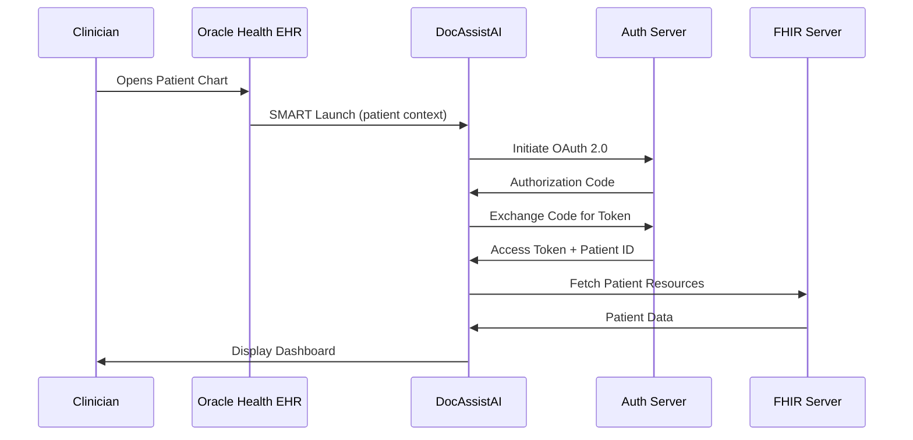

# DocAssistAI

A FHIR SMART on FHIR application for Oracle Health/Cerner that helps front-line clinicians quickly digest patient data through an AI-powered chatbot interface and automated document generation.

## Overview

DocAssistAI is a clinician-focused application that integrates with Oracle Health EHR systems to provide:
- **AI-Powered Chat Interface**: Natural language queries about patient data with context-aware responses
- **Document Generation**: Automated clinical note generation with AI assistance
- **Patient Data Visualization**: Quick access to patient summaries, timelines, and key metrics
- **Data Aggregation**: Intelligent summarization of patient history and insights

## Features

### Current Phase (Foundation)
- ✅ SMART on FHIR authentication and launch
- ✅ Patient context extraction and management
- ✅ Basic FHIR data fetching and display
- ✅ Patient summary dashboard

### Planned Features
- 🔄 AI chatbot interface for patient data queries
- 🔄 Clinical document generation (progress notes, SOAP notes)
- 🔄 Patient data visualizations (timeline, vitals charts)
- 🔄 Advanced data insights and pattern recognition
- 🔄 Multi-patient analysis (for researchers/back-office staff)

## Tech Stack

### Frontend
- **React 18+** with TypeScript
- **Vite** for build tooling
- **Zustand** for state management
- **fhirclient** for FHIR/SMART integration
- **Tailwind CSS** for styling
- **Recharts** for data visualization

### AI Integration
- **OpenAI GPT-4** or **Anthropic Claude** (configurable)
- Frontend API integration (can be moved to backend later)

### FHIR Resources Supported
- Patient, Condition, Observation, MedicationRequest
- Encounter, DiagnosticReport, Procedure
- AllergyIntolerance, Immunization, CarePlan
- DocumentReference, Communication, ServiceRequest
- And more (see `src/config/fhirConfig.ts`)

## Prerequisites

- Node.js 18+ and npm
- Oracle Health Code Console account
- Oracle Health sandbox access
- OpenAI API key (or other AI provider)

## Getting Started

### 1. Clone and Install

```bash
cd /Users/bitbox/Documents/DocAssistAI
npm install
```

### 2. Environment Configuration

Create a `.env.local` file in the root directory:

```env
# Oracle Health Sandbox Configuration
VITE_TENANT_ID=ec2458f2-1e24-41c8-b71b-0e701af7583d
VITE_FHIR_BASE_URL=https://fhir-ehr-code.cerner.com/r4/ec2458f2-1e24-41c8-b71b-0e701af7583d
VITE_AUTH_BASE_URL=https://authorization.cerner.com
VITE_CLIENT_ID=your_client_id_here
VITE_REDIRECT_URI=http://localhost:8080/redirect

# AI Service Configuration
VITE_AI_PROVIDER=openai
VITE_AI_API_KEY=your_openai_key_here
VITE_AI_MODEL=gpt-4

# App Configuration
VITE_APP_NAME=DocAssistAI
VITE_APP_ID=your_app_id_here
```

**Important:** Replace `your_client_id_here` and `your_openai_key_here` with your actual credentials.

### 3. Run Development Server

```bash
npm run dev
```

The app will be available at `http://localhost:8080`

### 4. Launch from Oracle Health Sandbox

1. Access the Oracle Health sandbox launcher
2. Launch DocAssistAI
3. The app will authenticate via SMART and receive patient context

## Project Structure

```
DocAssistAI/
├── src/
│   ├── components/          # React components
│   │   ├── layout/          # App layout components
│   │   ├── patient/         # Patient-related components
│   │   ├── chat/            # Chat interface components
│   │   ├── documents/       # Document generation components
│   │   └── common/          # Shared components
│   ├── services/            # Business logic services
│   │   ├── fhir/           # FHIR API client
│   │   ├── auth/           # SMART authentication
│   │   ├── ai/             # AI service integration
│   │   ├── documents/      # Document generation
│   │   └── data/           # Data aggregation
│   ├── hooks/              # Custom React hooks
│   ├── stores/             # Zustand state stores
│   ├── types/              # TypeScript type definitions
│   ├── utils/              # Utility functions
│   ├── config/             # Configuration files
│   ├── App.tsx             # Main app component
│   └── main.tsx            # Entry point
├── public/                 # Static assets
├── docs/                   # Documentation
│   └── AGENTS-README.md   # Agentic patterns reference
├── .env.local             # Environment variables (gitignored)
├── package.json
├── tsconfig.json
├── vite.config.ts
└── README.md
```

## Configuration

### Oracle Health Credentials

Your Oracle Health credentials are configured in `.env.local`:
- **Tenant ID**: Sandbox tenant identifier
- **Client ID**: Your application's client ID from Code Console
- **Redirect URI**: Must match what's configured in Code Console (`http://localhost:8080/redirect`)

### FHIR Scopes

The app requests comprehensive FHIR scopes for read/write access to patient resources. See `src/config/fhirConfig.ts` for the complete list.

### AI Provider

Currently supports:
- OpenAI (GPT-4, GPT-3.5)
- Anthropic Claude (configurable)

Set `VITE_AI_PROVIDER` and `VITE_AI_API_KEY` in `.env.local` to configure.

## Architecture

### SMART Launch Flow



### Key Services

- **FHIRClientService**: Handles all FHIR API interactions
- **SMARTAuthService**: Manages OAuth 2.0 flow and token management
- **AIService**: Interfaces with AI providers for chat and document generation
- **DataAggregator**: Processes and summarizes patient data

## Development

### Available Scripts

```bash
npm run dev          # Start development server
npm run build        # Build for production
npm run preview      # Preview production build
npm run lint         # Run linter
```

### Code Style

- TypeScript strict mode enabled
- ESLint for code quality
- Prettier for formatting (recommended)

## Agentic Patterns

This project uses various agentic design patterns for AI functionality. See `docs/AGENTS-README.md` for a complete reference of 20 agentic patterns and when to use each.

**Key Patterns Used:**
- **RAG (Pattern 13)**: Patient data retrieval
- **Reflection (Pattern 4)**: Document quality control
- **Prompt Chaining (Pattern 1)**: Multi-step clinical workflows
- **Tool Use (Pattern 5)**: FHIR API interactions
- **Human-in-the-Loop (Pattern 12)**: Critical decision points

## Security & Compliance

- **PHI Protection**: All patient data handled according to HIPAA guidelines
- **OAuth 2.0**: Secure authentication via SMART framework
- **Token Management**: Automatic token refresh and secure storage
- **Input Validation**: Guardrails for user inputs and AI outputs
- **Audit Logging**: Track all data access and modifications

## Testing

Testing is done in the Oracle Health sandbox environment with synthetic patient data.

### Test Checklist
- [ ] SMART launch flow works correctly
- [ ] Patient context is extracted properly
- [ ] FHIR data fetching succeeds
- [ ] Patient data displays correctly
- [ ] AI chat interface responds appropriately
- [ ] Document generation produces valid output

## Troubleshooting

### Common Issues

**SMART Launch Fails**
- Verify redirect URI matches Code Console configuration
- Check that client ID is correct
- Ensure you're launching from sandbox environment

**FHIR Data Not Loading**
- Verify tenant ID is correct
- Check network connectivity
- Review browser console for errors
- Ensure proper scopes are requested

**AI Service Errors**
- Verify API key is set correctly
- Check API quota/limits
- Review AI service logs

## Roadmap

### Phase 1: Foundation ✅
- SMART integration
- Basic patient data display
- Configuration setup

### Phase 2: Core Features (In Progress)
- AI chat interface
- Document generation
- Data visualizations

### Phase 3: Advanced Features (Planned)
- Multi-patient analysis
- Advanced insights
- Research capabilities
- Performance optimizations

## Future Directions

The following advanced features are planned for future development:

### 1. Clinical Guideline Integration & Domain Detection

**Intelligent Guideline Recommendations**
- Automatically detect the clinical domain/problem the clinician is addressing
- Provide real-time access to the most up-to-date treatment and diagnostic guidelines
- Offer evidence-based suggestions and recommendations based on current clinical guidelines
- Support multiple guideline sources (e.g., specialty-specific guidelines, national protocols)
- Context-aware guideline matching based on patient presentation and clinical context

**Use Cases:**
- Clinician queries patient data → System detects clinical domain → Presents relevant guidelines
- Real-time decision support during patient care
- Treatment pathway recommendations based on current best practices

### 2. Clinical Sign-Out & Event Summarization

**Intelligent Handoff Summaries**
- Generate comprehensive summaries of clinical events over specified time frames
- Capture and summarize:
  - Clinical events and interventions
  - New or pertinent laboratory results
  - Imaging studies and findings
  - Changes in vital signs and trends
  - New consultations and specialist recommendations
  - Medication changes and adjustments

**Tailored Sign-Out Reports**
- Customizable summaries based on clinician role and needs
- Examples:
  - **ICU Night Shift Handoff**: Focus on critical events, vital sign trends, and acute interventions
  - **Weekend Coverage Summary**: Highlight new developments, pending results, and urgent follow-ups
  - **Consultant Return Summary**: Comprehensive overview of changes during absence
  - **Transfer Summaries**: Key information for patient handoffs between units

**Features:**
- Time-range selection (e.g., "What happened over the weekend?", "Last 24 hours")
- Role-based filtering (e.g., cardiology-focused vs. general medicine)
- Prioritization of critical information
- Chronological event timeline

### 3. Predictive Analytics & Clinical Deterioration Monitoring

**Machine Learning-Powered Risk Assessment**
- Real-time monitoring and probability calculations for patient deterioration
- Specialized models for high-risk clinical scenarios:

**Sepsis Detection & Monitoring**
- Early warning indicators
- Probability scoring for sepsis development
- Trend analysis of vital signs and lab values

**Neurological Monitoring**
- Subarachnoid hemorrhage (SAH) risk assessment
- Delayed cerebral ischemia (DCI) prediction and monitoring
- Neurological deterioration probability

**Bleeding Risk Assessment**
- Trauma patient bleeding risk stratification
- Post-surgical bleeding probability
- Real-time monitoring of bleeding indicators

**Features:**
- Continuous monitoring with configurable alert thresholds
- Probability scores with confidence intervals
- Trend visualization and risk trajectory analysis
- Integration with existing clinical decision support systems
- Alert notifications for high-probability events

**Technical Approach:**
- ML models trained on clinical data patterns
- Integration with FHIR Observation and Condition resources
- Real-time data processing and risk calculation
- Explainable AI for transparency in clinical decision-making

## Contributing

This is a private project. For questions or issues, contact the development team.

## License

Proprietary - All rights reserved

## Resources

- [Oracle Health FHIR Documentation](https://docs.oracle.com/en/industries/health/millennium-platform-apis/)
- [SMART on FHIR Specification](http://hl7.org/fhir/smart-app-launch/)
- [FHIR R4 Specification](https://www.hl7.org/fhir/R4/)
- [Agentic Patterns Catalog](./docs/AGENTS-README.md)

## Support

For technical support or questions:
- Check the documentation in `/docs`
- Review Oracle Health Code Console for API updates
- Contact: [Your contact information]

---

**Built with ❤️ for clinicians**

